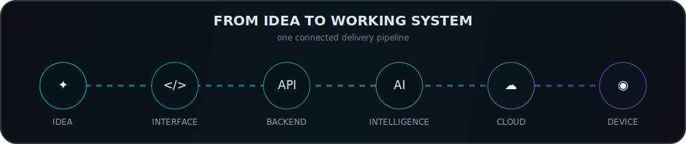
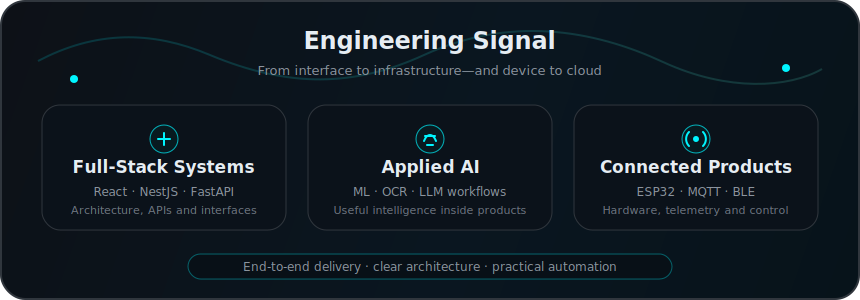
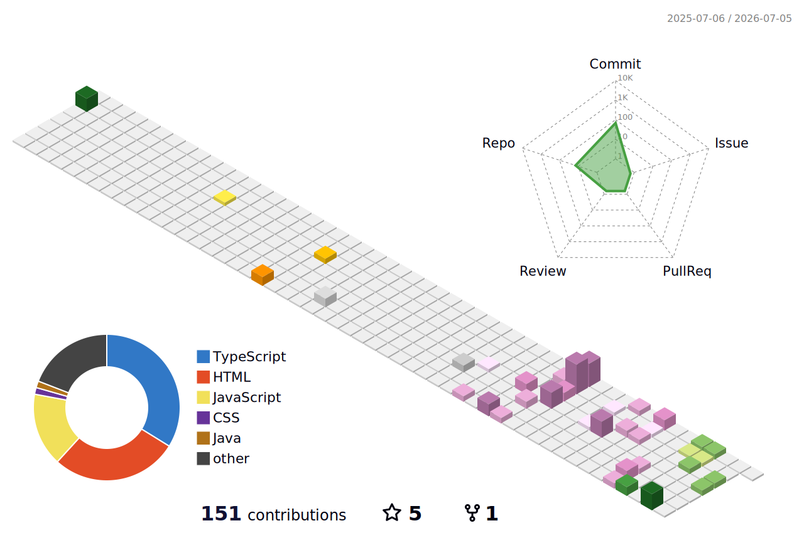

<div align="center">
  
</div>

<div align="center">

<a href="https://sofienezayati.tn">
  
</a>

<p>
  <a href="https://sofienezayati.tn">
    
  </a>
  <a href="https://sofienezayati.tn/cv.pdf">
    
  </a>
  <a href="https://www.linkedin.com/in/sofiene-zayati">
    
  </a>
  <a href="mailto:sofiene.zayati@gmail.com?subject=Portfolio%20Contact">
    
  </a>
</p>

<p>
  
  
  
</p>

</div>

---

## `> whoami`

```ts
const sofiene = {
  role: "Full-Stack & AI Developer",
  background: "Embedded & Mobile Systems",
  education: "Web & Internet Technologies Engineering — ESPRIT",
  focus: [
    "AI-powered platforms",
    "Full-stack architecture",
    "Cloud and DevOps",
    "IoT and embedded systems",
  ],
  location: "Tunis, Tunisia",
};
```

I build complete intelligent systems—from embedded controllers and backend services to polished interfaces, machine-learning features, automation workflows, and deployment pipelines.

<div align="center">
  
</div>

---

## Selected Work

<table>
  <tr>
    <td width="50%" valign="top">
      <h3>◈ SmartProperty</h3>
      <p><strong>AI-Powered Real Estate Platform</strong></p>
      <p>Multi-role platform combining recommendation models, price prediction, OCR, computer vision, AI assistants, voice navigation, analytics, and real-time features.</p>
      <p><code>React</code> <code>NestJS</code> <code>FastAPI</code> <code>MongoDB</code> <code>PyTorch</code> <code>XGBoost</code> <code>Docker</code> <code>Kubernetes</code></p>
      <p><a href="https://sofienezayati.tn/project/smartproperty">Case study</a> · <a href="https://youtu.be/z0v_b0Qgeng">Video demo</a></p>
    </td>
    <td width="50%" valign="top">
      <h3>◈ Prigado AI</h3>
      <p><strong>Intelligent E-Commerce Automation</strong></p>
      <p>AI workflows and assistants for product enrichment, sales analytics, marketing automation, customer support, and logistics prediction.</p>
      <p><code>n8n</code> <code>Laravel</code> <code>Vue.js</code> <code>MySQL</code> <code>Gemini</code> <code>REST APIs</code></p>
      <p><a href="https://sofienezayati.tn/project/prigado">Case study</a></p>
    </td>
  </tr>
  <tr>
    <td width="50%" valign="top">
      <h3>◈ MacroPark</h3>
      <p><strong>Smart Parking Ecosystem</strong></p>
      <p>Connected parking platform with license-plate recognition, WT32 barrier controllers, MQTT, BLE fallback, OTA updates, mobile access, and live event monitoring.</p>
      <p><code>C++</code> <code>FastAPI</code> <code>MQTT</code> <code>BLE</code> <code>Docker</code> <code>Flutter</code> <code>WT32</code></p>
      <p><a href="https://sofienezayati.tn/project/macropark">Case study</a> · <a href="https://github.com/SofieneZayati/MacroPark">Repository</a></p>
    </td>
    <td width="50%" valign="top">
      <h3>◈ InnoMall</h3>
      <p><strong>Integrated Mall Management System</strong></p>
      <p>JavaFX and Symfony platform with IoT parking, reservations, Stripe payments, analytics, notifications, and an AI chatbot.</p>
      <p><code>Symfony</code> <code>Java</code> <code>JavaFX</code> <code>MySQL</code> <code>Stripe</code> <code>Gemini</code> <code>IoT</code></p>
      <p><a href="https://sofienezayati.tn/project/innomall">Case study</a> · <a href="https://github.com/Eya-ajimi/pi_symfony1">Repository</a> · <a href="https://youtu.be/Zs875HdhmJ8">Video demo</a></p>
    </td>
  </tr>
</table>

<div align="center">
  <a href="https://sofienezayati.tn">
    
  </a>
</div>

---

## Experience & Education

### Experience

- **AI Automation & Full-Stack Developer — Inspark Connect**  
  Built AI-powered workflows and intelligent assistants for the Prigado e-commerce platform.

- **Embedded Systems & Software Developer Intern — Scheidt & Bachmann**  
  Developed MacroPark with license-plate recognition, connected barriers, MQTT, BLE, mobile access, and backend services.

- **Hardware & Software Project Manager Intern — Scheidt & Bachmann**  
  Built a secure smart-lock system using ESP32, BLE authentication, and MQTT communication.

- **Web Development Intern — Sotunol**  
  Developed and improved the company’s web platform.

### Education

- **Engineering Cycle in Web and Internet Technologies (TWIN)** — ESPRIT, 2024–Present
- **Bachelor’s Degree in Embedded and Mobile Systems** — ISET Radès, 2021–2024

### Languages

Arabic — Native · English — Fluent · French — Fluent · German — Goethe-Zertifikat A2

---

## Technology Map

<div align="center">

### Languages


### Frontend


### Backend


### AI, Data & Automation

<br />


### Databases


### Cloud & DevOps


### Embedded Systems & IoT

<br />


</div>

---

## Engineering Signal

<div align="center">
  
</div>

---

## Animated 3D Contribution Landscape

<div align="center">
  
</div>

> Generated automatically every day by GitHub Actions.

---

## Contribution Arcade

<picture>
  <source media="(prefers-color-scheme: dark)" srcset="https://raw.githubusercontent.com/SofieneZayati/SofieneZayati/output/pacman-contribution-graph-dark.svg" />
  <source media="(prefers-color-scheme: light)" srcset="https://raw.githubusercontent.com/SofieneZayati/SofieneZayati/output/pacman-contribution-graph.svg" />
  
</picture>

> Pac-Man is generated automatically by the included GitHub Actions workflow and published to the `output` branch.

---

## Contact

<div align="center">
  <p>Open to full-stack, AI automation, embedded systems, and IoT opportunities.</p>
  <p>
    <a href="mailto:sofiene.zayati@gmail.com?subject=Portfolio%20Contact">
      
    </a>
    <a href="https://www.linkedin.com/in/sofiene-zayati">
      
    </a>
  </p>
  <p><code>sofiene.zayati@gmail.com</code></p>
</div>

<div align="center">
  
</div>
